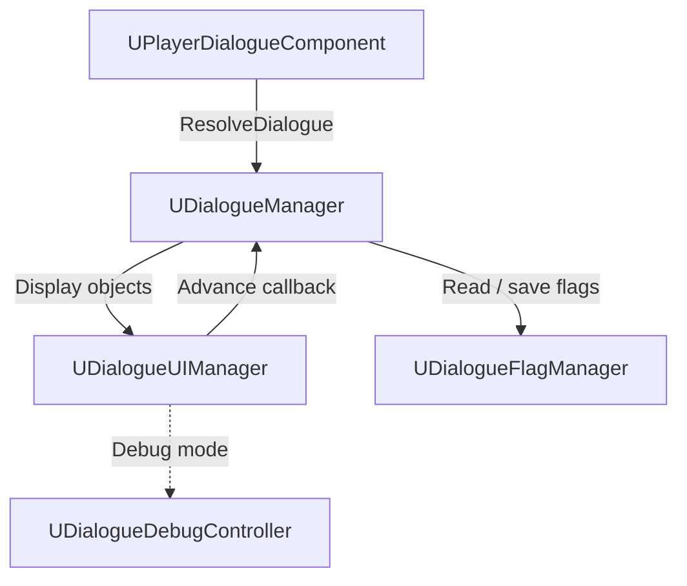

# Dialogue System Runtime Architecture

## 1. Architecture at a Glance

The dialogue system is built around **three game‑level subsystems**, a lightweight **actor‑side resolver**, and an optional **debug UI**. At runtime these parts interact in a tight loop:

1. **Resolver → DialogueManager**  – An actor component (e.g., `UPlayerDialogueComponent`) selects a `UDialogueDataAsset` and calls `UDialogueManager::StartDialogue()`.
2. **DialogueManager ↔ DialogueUIManager**  – `UDialogueManager` drives the conversation state‑machine while `UDialogueUIManager` renders the current line or choice and returns player input through a bound delegate.
3. **Flag persistence**  – All reads and writes to dialogue flags go through `UDialogueFlagManager`, ensuring state survives level loads.

This separation keeps **gameplay logic** (branching & flags) in C++, while leaving **presentation** (widgets) and **authoring** (data assets) in designers’ hands.

---

## 2. Core Components

| Layer               | Class                      | Purpose                                                                                   |
| ------------------- | -------------------------- | ----------------------------------------------------------------------------------------- |
| **Core Subsystems** | `UDialogueManager`         | Starts / ends dialogue sessions and coordinates UI & flag storage                         |
|                     | `UDialogueUIManager`       | Presents dialogue data (sentences & choices) and returns player selections to the manager |
|                     | `UDialogueFlagManager`     | Maintains the global flag table in memory and serialises changes                          |
| **Actor‑side**      | `UPlayerDialogueComponent` | Lives on an actor; chooses which dialogue asset to run, then hands off to the manager     |
| **Debug Tools**     | `UDialogueDebugController` | Receives display objects from `UDialogueUIManager` when debug mode is active              |
|                     | `UDialogueDebugWidget`     | Widget that lists dialogue assets and forwards “advance” requests back to the manager     |
| **Data Model**      | `FFlagTableRow`            | Struct that represents a single entry in the project‑wide flag data table                 |

---

## 3. Runtime Data & Control Flow

---

## 4. Interaction Walk‑through

1. **Start** – The actor component asks `UDialogueManager` to launch a conversation.
2. **Presentation** – The manager streams display objects (sentences or choices) to `UDialogueUIManager`, which renders them—or passes them to the debug controller when testing.
3. **Player Input** – When the player selects an option, `UDialogueUIManager` invokes the manager’s advance callback.
4. **Persistence** – Flag reads/writes travel through `UDialogueFlagManager`, so choices persist across level loads.
5. **End** – When the conversation reaches a terminal node, the manager triggers `EndDialogue` and returns control to gameplay.

---

## 5. Summary

- **Modular**: Clear split between logic, presentation, and persistence.
- **Designer‑friendly**: Data assets and widgets remain accessible to non‑programmers.
- **Debuggable**: Built‑in debug controller & widget speed up script iteration.

This document captures the essential relationships between the main classes without delving into internal algorithms or condition evaluation logic.

