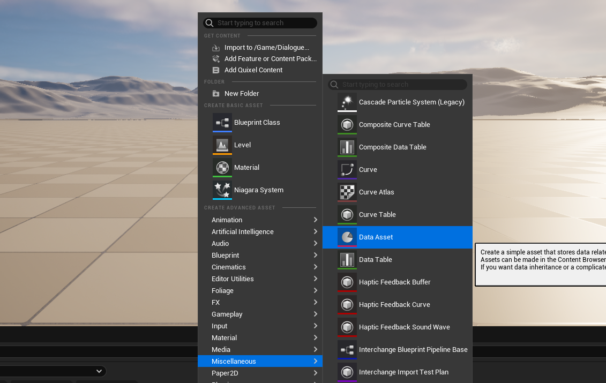
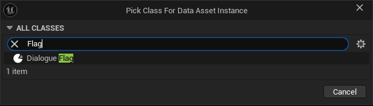
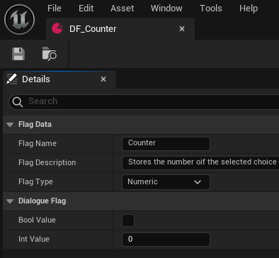
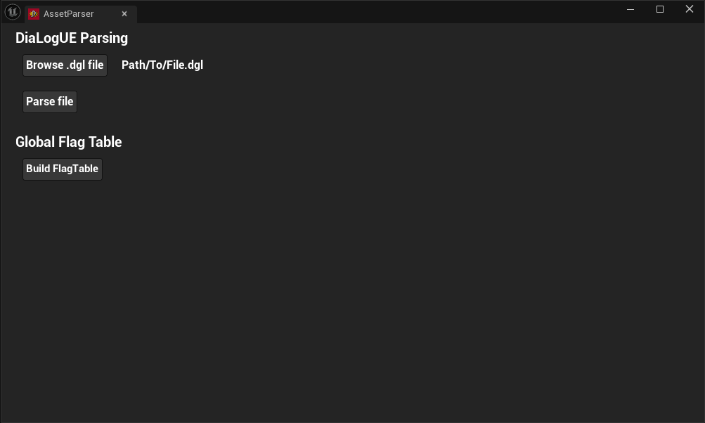

# Getting Started with the First Dialogue

> How to write your first dialogue and display it in debug mode. Step-by-step guide

---

## Steps

1. Write .dgl file that conforms to DiaLogUE syntax
2. [Opt.] If you use any dialogue flags, create these beforehand
3. Navigate to the *Asset Parser* tab and parse the file
4. [Opt.] If you use any dialogue flags, create a global flag table in *Asset Parser* tab
5. Press on play and select the generated asset in the asset drop down of the debug widget.

## Step 1: .dgl File
You can use [ExampleDIalogue.dgl](../resources/ExampleDialogue.dgl) or write your own plain text.

---

## Step 2: Creating Dialogue Flags
1. Create a new *DataAsset* BP and select *DialogueFlag* as the base

  

  

Here is the example of how to setup **Counter** dialogue flag that is used in the [ExampleDIalogue.dgl](../resources/ExampleDialogue.dgl). 

  

**Flag Name**: The name of the flag as referenced in the .dgl file.
**Flag Description**: Is not displayed anywhere. Just to provide the context for the development purposes. 
**Flag Type**: Set to boolean or numeric, depending on the flag type.

**NB1: The name of the flag asset itself can be set to whatever. Only the Flag Name attribute should match the name of the flag as referenced in .dgl.**

**NB2: For numeric flags, set the Int Value to any other that differs from the one that is set by default. The huge default value should remain untouched if you decide to make this flag boolean.**

---

## Step 3: Asset Parser
If *Asset Parser* is not opened, navigate to the DiaLogUE plugin setting under project settings and set **OpenAssetParserOnStartup** to true and restart the editor. 

  

Press **Browse .dgl file** and select the .dgl file in the explorer. Then proceed with **Parse File**. Examine the log ouput and ensure that parsing went smoothly. Fix the errors if applicable. 

---

## Step 4: Flag Table Generation
The runtime system needs a table for the flag lookup. Press **Build FlagTable** to generate it. Examine the *Output Log* and ensure that table generation was successful. 