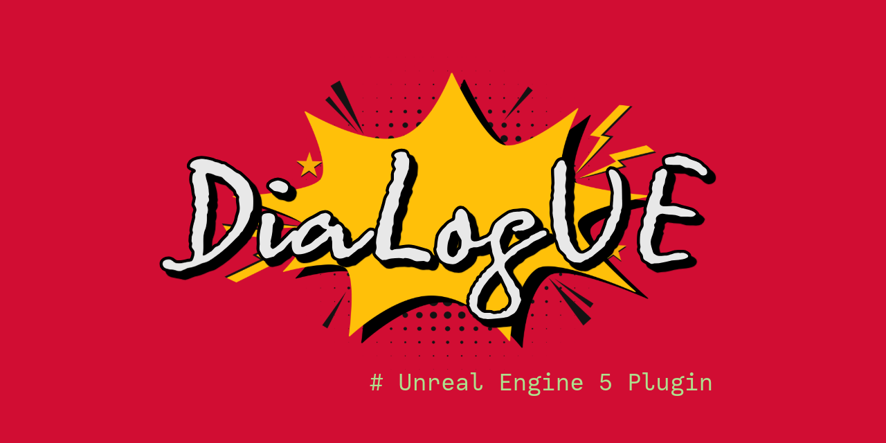
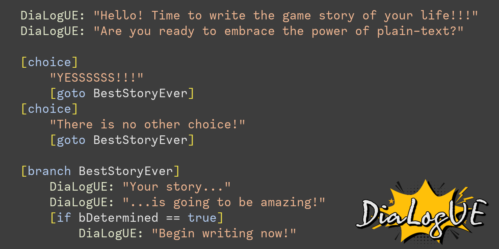

# DiaLogUE Unreal Plugin

**DiaLogUE** is an Unreal Engine plugin designed to empower writers and narrative designers to create complex, branching narrative content in a clean, readable, non-programmer-friendly format.

## What is DiaLogUE?

DiaLogUE allows you to store dialogue and branching storylines in simple `.dgl` text files using a custom scripting language *DiaLogUE* that’s:
- **Plain text** (easy to read, edit, and diff)
- **Human-readable** and approachable for non-programmers
- Powerful enough to support large, complex dialogue structures, choices, conditionals, and more

You can preview the syntax in the [DiaLogUE Syntax Examples](DiaLogUE_Syntax_Examples.md) file.

## How does it work?

1. **Write** your dialogue in `.dgl` files using the DiaLogUE language.
2. **Parse** these files with the DiaLogUE Unreal plugin into Unreal Engine data assets.
3. **Consume** these assets at runtime in your game.  
   The plugin is designed so that lookups are performed in the effective **O(1) fashion**—fast enough for even the most dynamic branching systems.

## Key Features

- Store dialogue logic in plain text—no need to open the Unreal Editor for writing or maintaining branches
- Easily supports **choices, conditions, variables, flags (numeric and boolean), and branching**
- Very **easy to read**—anyone on your team can contribute, not just programmers
- Parser outputs **native Unreal data assets** ready for use by runtime systems

## Syntax Highlighting

For the best authoring experience, use the [DiaLogUE Syntax Highlighting VS Code extension](https://github.com/wortback/DiaLogUE)  
This extension gives you instant feedback, colouring, and structure in `.dgl` files.

After installing the extension, you can preview the highlighting here [DiaLogUE Examples](DiaLogUESyntax.dgl).

## Roadmap

- **Coming Soon:**  
  - Full runtime system for consuming data assets in Unreal Engine
  - Example UI implementation to show how dialogues can be played in-game

## License

MIT

---

*DiaLogUE aims to make game writing as intuitive as possible—freeing you from editor clutter and unlocking the power of plain text for your narrative!*
